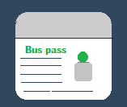

	<!DOCTYPE html>
<html>
<head>
	<meta charset="utf-8">
	<meta name="viewport" content="width=device-width, initial-scale=1">
	<title>BUS PASS MANEGEMENT SYSTEM website</title>
	
<body>
<header>
	<table><tr><th>
	<h1></h1></th><th>
	<h3 style="color:#FFC90E">BUSPASS MANAGEMENT SYSTEM</h3></th>
</tr>
</table>
	<nav>
		<a href="#">Home</a>
		<a href="about.html">About</a>
		<a href="viewpass.php">View Pass</a>
		
		
	</nav>
	

	
	<button><a  href="Adminlogin.php">Admin</a></button>

</header>

  

	<table class="home">
		<tr>
			<th>
	<table class="reg">
		<tr class="reg1">
			<th><a href="click.php">Click Here Regitration</a></th>

		     </tr>

	</table>
</th>
<th><th>
	<table class="reg">
		<tr class="reg1">
			<th><a href="Registration details.php">Regitration Deatails</a></th>

		     </tr>

	</table>
</th>
<th><th>
	<table class="reg">
		<tr class="reg1">
			<th><a href="seasonpassview.php">Season deatilsBusPass</a></th>

		     </tr>

	</table>
</th>

</tr>

</table>

	

	<table class="home">
		<tr>
			<th>
	<table class="reg">
		<tr class="reg1">
			<th style="padding:10px;"><a href="seasonalpass.php">ClickPass Season </a></th>

		     </tr>

	</table>
</th>
<th><th>
	<table class="reg">
		<tr class="reg1">
			<th style="padding:10px;"><a href="Application1.php"> generalpass Details</a></th>

		     </tr>

	</table>
</th>
<th><th>
	<table class="reg">
		<tr class="reg1">
			<th style="padding:10px;"><a href="student Documents.php">Documents verified </a></th>

		     </tr>

	</table>
</th>

</tr>

</table>

 

	Contact Us:- 
	            For Related Queries: 
	            E-mail:onlineBusPass@gmail.com 
	            Phone number:0866 2570005 

</body>
</html>
